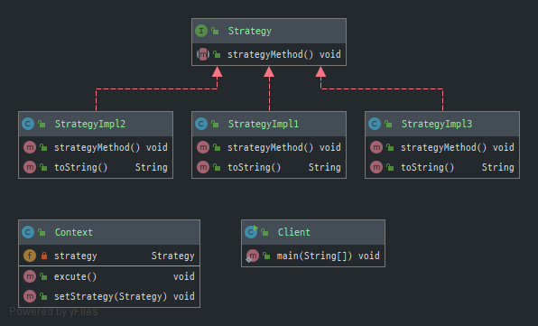

# 전략 패턴 (Strategy Pattern)

> 전략(Strategy), 정책(policy) 패턴은 실행 중에 알고리즘을 선택할 수 있게 하는 디자인 패턴
> 1. 특정한 계열의 알고리즘을 정의 (인터페이스 정의와 구현)
> 2. 각 알고리즘을 캡슐화 
> 3. 이 알고리즘을 해당 계열 안에서 상호 교체가 가능하도록 만듬 

> 객체들이 할 수 있는 행위에 대해 전략 클래스를 생성하고, 유사한 행위들을 캡슐화 하는 인터페이스를 정의하여,
> 객체의 행위를 동적으로 바꾸고 싶은 경우 직접 행위를 수정하지 않고 전략을 바꿔줌으로써 유연하게 확장 하는 방법

