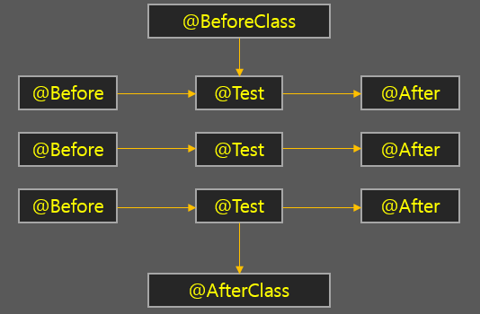

# JUnit

> JUnit(제이유닛)은 자바 프로그래밍 언어용 유닛 테스트 프레임워크이다. JUnit은 테스트 주도 개발 면에서 중요하며 SUnit과 함께 시작된 XUnit이라는 이름의 유닛 테스트 프레임워크 계열의 하나이다
>> 테스트 메서드를 실행할 때마다 매번 테스트 클래스의 새로운 오브젝트를 만든다.
>> 따라서 모든 테스트는 서로 영향을 주지 않으며 독립적인 실행을 보장한다.

### 1. @Test
테스트를 수행하는 메소드를 지정, jUnit에서는 각각의 테스트가 서로 영향을 주지 않고 독립적으로 실행되는 것을 지향하며 @Test 단위 마다 필요한 객체를 생성해 지원
### 2. @Ignore
테스트를 실행하지 않도록 해줌, 메소드는 남겨두되 테스트에 포함되지 않도록 하려면 이 어노테이션을 붙여두면 됨
### 3. @Before / @After
테스트 메소드가 실행되기 전, 후로 항상 실행되는 메소드를 지정, 공통적으로 실행되어야 하는 메소드가 있다면 어노테이션을 붙여주면 됨, 각각의 테스트 메소드에 적용
### 4. @BeforeClass / @AfterClass
각각의 메소드가 아닌 해당 클래스에서 딱 한번만 수행되는 메소드, 테스트 메소드의 갯수와 상관없이 딱 한번만 실행

## 실행순서

### 참고
[https://codevang.tistory.com/259](https://codevang.tistory.com/259)