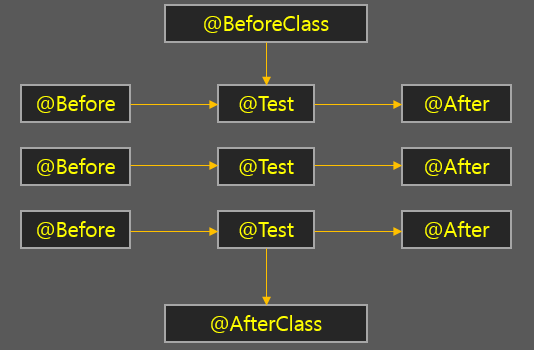

# JUnit

> JUnit(제이유닛)은 자바 프로그래밍 언어용 유닛 테스트 프레임워크이다. JUnit은 테스트 주도 개발 면에서 중요하며 SUnit과 함께 시작된 XUnit이라는 이름의 유닛 테스트 프레임워크 계열의 하나이다
>> 테스트 메서드를 실행할 때마다 매번 테스트 클래스의 새로운 오브젝트를 만든다.
>> 따라서 모든 테스트는 서로 영향을 주지 않으며 독립적인 실행을 보장한다.

### 1. @Test
테스트를 수행하는 메소드를 지정, jUnit에서는 각각의 테스트가 서로 영향을 주지 않고 독립적으로 실행되는 것을 지향하며 @Test 단위 마다 필요한 객체를 생성해 지원
### 2. @Ignore
테스트를 실행하지 않도록 해줌, 메소드는 남겨두되 테스트에 포함되지 않도록 하려면 이 어노테이션을 붙여두면 됨
### 3. @Before / @After
테스트 메소드가 실행되기 전, 후로 항상 실행되는 메소드를 지정, 공통적으로 실행되어야 하는 메소드가 있다면 어노테이션을 붙여주면 됨, 각각의 테스트 메소드에 적용
### 4. @BeforeClass / @AfterClass
각각의 메소드가 아닌 해당 클래스에서 딱 한번만 수행되는 메소드, 테스트 메소드의 갯수와 상관없이 딱 한번만 실행

## 실행순서 ([참고](https://codevang.tistory.com/259))


### 문법
- class는 항상 public으로 선언한다
  - 관례상 클래스명은 테스트할 클래스명+Test로 작성한다.
- method는 항상 public으로 선언하고 void 타입이어야 한다. 
- method는 파라미터가 없어야 한다.
- method는 static으로 선언할 수 없다.

### 구성방법
- 병렬 디렉토리 구조로 테스트소스를 배치
- Best practice
    ```text
    ── pom.xml
    └── src
        ├── main
        │   ├── java
        │   │   └── com
        │   │       └── javadevelopersguide
        │   │           └── junit
        │   │               └── Calculator.java
        │   ├── resources
        └── test
            ├── java
            │   └── com
            │       └── javadevelopersguide
            │           └── junit
            │               └── CalculatorTest.java
            └── resources
    ```

### 주의사항 ([참고](https://www.javaguides.net/2018/08/junit-framework-best-practices.html))
- #### 테스트 케이스 내에서 실행되는 순서를 지정하지 말것
    ```text
    기본적으로 Junit은 임의의 순서로 테스트가 실행됨, 테스트 순서를 변경하는 방법은 제공하지만
    사용하지 않는 것이 단위 테스트가 지향하는 바와 일치함
    ```
  `@FixMethodOrder(MethodSorters.JVM), @FixMethodOrder(MethodSorters.NAME_ASCENDING)`
- #### 단위 테스트를 스킵하지 말것
    ```text
    Do not use JUnit's @Ignore annotation.
    Do not use Maven's maven.test.skip property.
    Do not use the Maven Surefire Plugin's skipTests property.
    Do not use the Maven Surefire Plugin's excludes property.
    ```
- #### 테스트 하나당 하나의 어설션만 수행할 것
  각 단위 테스트가 하나의 어설션을 갖도록 하는데는 두가지 이유가 있음
  > 단위 테스트가 실패하면 무엇이 잘못되었는지 확인하는것이 쉬움
  >> 만약 실패한 단위테스트에 세개의 어설션이 있는 경우 어떤것이 실패했는지 확인하기 위한 작업이 필요함 
  >> 하나의 어설션만 있는 경우에는 이러한 노력이 필요하지 않음
  > 
  > 두개 이상의 어설션을 실행하는 경우 모든 검증문이 발생한다고 보장할 수 없음
  >> 실패한 어설션이 발생할경우 이후의 어설션은 실행되지 않으며 Junit은 단위테스트에 오류가 있는 것으로 표시하고
  >> 다음 테스트 메서드로 진행함
  